basemapR
================
07/01/2020

## Installing basemapR

Install from github using devtools:

``` r
library(devtools)
install_github('Chrisjb/basemapR')
```

## Adding a basemap to ggplot2

the `base_map` function can be added to a ggplot2 call as follows:

``` r
library(ggplot2)
library(sf)
library(basemapR)

ggplot() +
  base_map(st_bbox(localauth_data), increase_zoom = 2) +
  geom_sf(data = localauth_data, fill = NA)
```

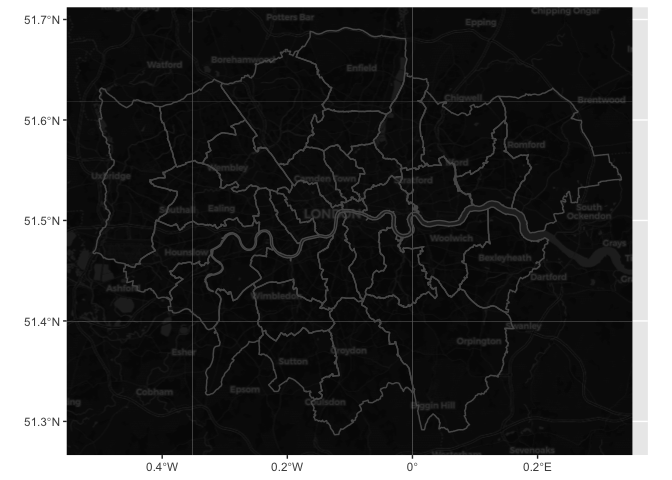<!-- -->

#### bbox

A bounding box created using `st_bbox` or the basemapR function
`expand_bbox` (see below). The bounding box defines the extents over
which we want the base map to be returned.

This will normally be the largest layer on our map. Sometimes we will
have two distinct layers neither of which covers the full extent of the
map on their own. For example:

``` r
library(dplyr)
```

    ## 
    ## Attaching package: 'dplyr'

    ## The following objects are masked from 'package:stats':
    ## 
    ##     filter, lag

    ## The following objects are masked from 'package:base':
    ## 
    ##     intersect, setdiff, setequal, union

``` r
library(basemapR)
library(sf)


camden <- localauth_data %>% 
  filter(Name  == 'Camden')

wandsworth <- localauth_data %>% 
  filter(Name  == 'Wandsworth')


ggplot() +
  geom_sf(data = camden) +
  geom_sf(data = wandsworth)
```

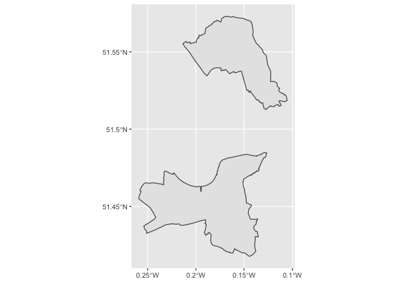<!-- -->

We need to create a bbox that combines both layers for the base map to
cover the full extents of the
canvas:

``` r
# create bbox polygons for each and union and then convert back to bbox object
my_bbox <- st_bbox(camden) %>%
  st_as_sfc() %>%
  st_union(st_as_sfc(st_bbox(wandsworth))) %>%
  st_bbox()
```

``` r
ggplot() +
  base_map(bbox = my_bbox, basemap = 'hydda', increase_zoom = 2) +
  geom_sf(data = camden, fill = NA) +
  geom_sf(data = wandsworth, fill = NA) +
  ggthemes::theme_map()
```

    ## attribution: Tiles courtesy of http://openstreetmap.se/ OpenStreetMap Sweden; Map data &copy; <a href="https://www.openstreetmap.org/copyright">OpenStreetMap</a> contributors

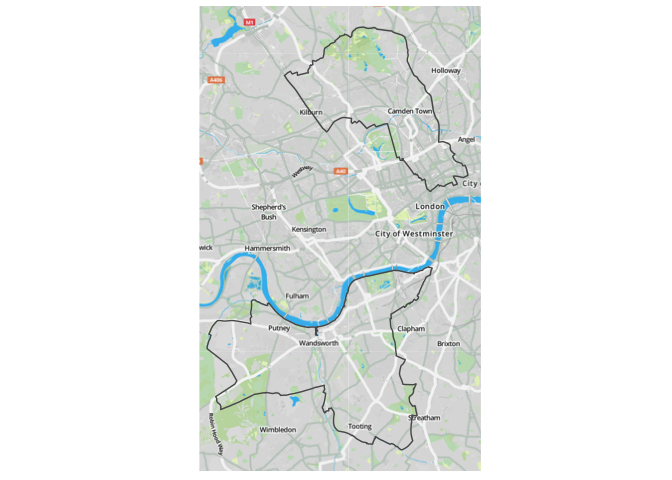<!-- -->

#### increase\_zoom

The zoom parameter is calculated automatically. It can be increased by
setting increase\_zoom to an integer value. In the first example we set
`increase_zoom = 2`. We can play around with this value as per our
desired aesthetic.

#### basemap

Various options for base maps. The attribution for the base layer should
be included on the maps and is returned as a message from the function.

**dark**

attribution: ©
<a href="https://www.openstreetmap.org/copyright">OpenStreetMap</a>
contributors © <a href="https://carto.com/attributions">CARTO</a>
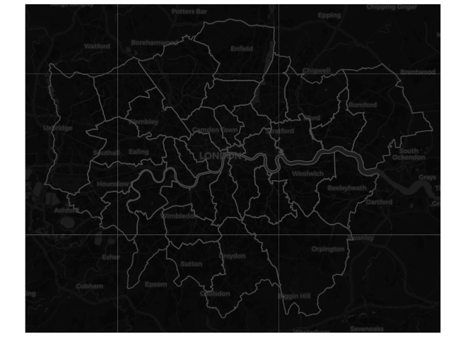<!-- -->

**hydda**

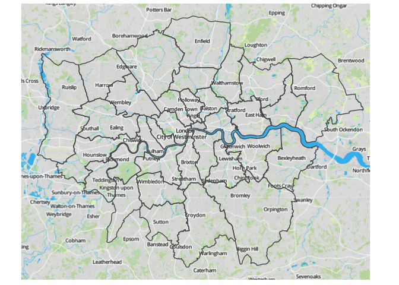<!-- -->

**positron**

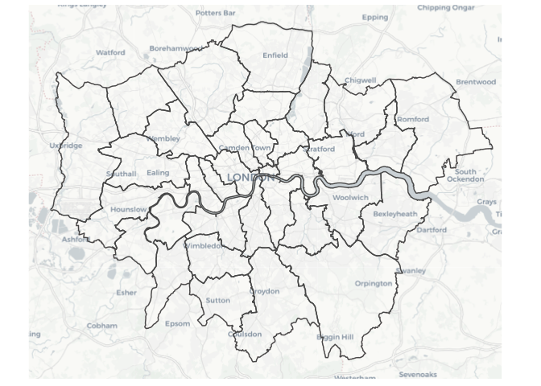<!-- -->

**voyager**

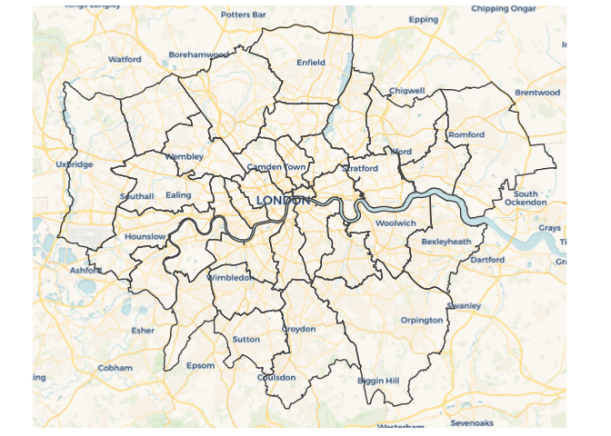<!-- -->

**wikimedia**

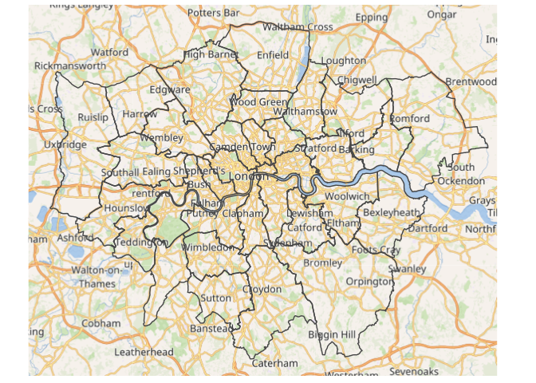<!-- -->

**mapnik**

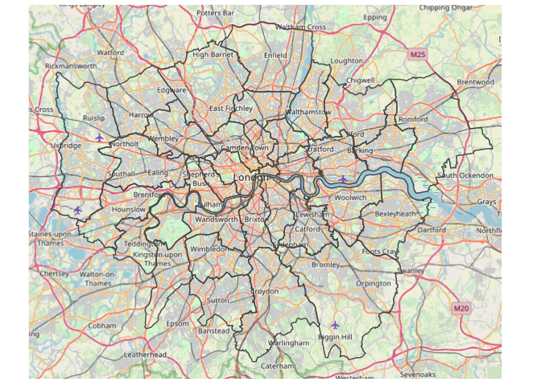<!-- -->

**neighbourhood**

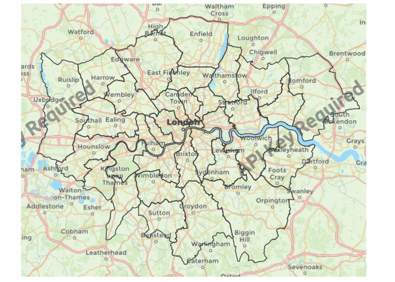<!-- -->

## expand\_bbox

This function takes in a bbox object and expands it by a set number of
meters in the `X` and `Y` directions. If we want an asymmetric expansion
(100m to the east but 1km to the west) we can also specify the
parameters `X2` and `Y2`.

``` r
# define a single point
point <- data.frame(x = -0.086543 ,
                    y= 51.504567) %>%
  st_as_sf(coords= c('x','y'), crs = 4326)

# standard bbox for our point
my_bbox_1 <- st_bbox(point)

# expand the bbox by 1000m
my_bbox_2 <- expand_bbox(my_bbox_1, X = 1000, Y = 1000)
```

We will have to also set the x and y limits ourselves in `coord_sf` to
clip the canvas to our basemap:

``` r
ggplot() + 
  base_map(my_bbox_2, increase_zoom = 1, basemap = 'positron')+
  geom_sf(data = point) +
  coord_sf(xlim = c(my_bbox_2['xmin'], my_bbox_2['xmax']),
           ylim = c(my_bbox_2['ymin'],my_bbox_2['ymax']),crs = 4326)
```

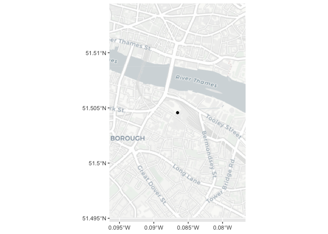<!-- -->
